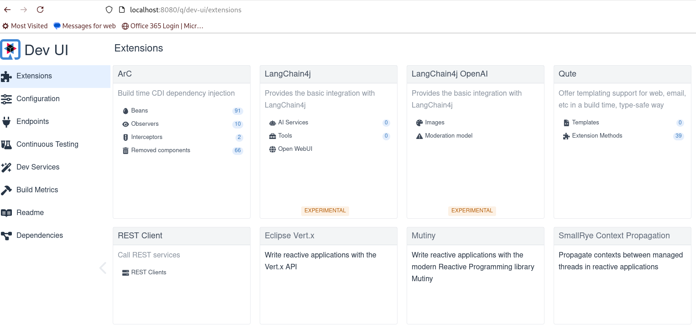
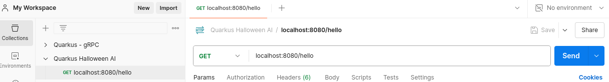

# Getting Started

First let's create a new project using Quarkus and LangChain4j.

Tools used to create this project:

- Java 21
- Quarkus CLI
- IntelliJ EAP
- Postman
- Minikube
- Docker or Podman
- Docker or Podman Desktop
- Minikube or Kind for K8s
- OpenAI key with environment variable $OPENAI_API_KEY 
- (Optional) tmux in the terminal is helpful but obviously not required
- (Optional) Linux: tree, curl etc...
- (Optional) zsh for the terminal is visually helpful if giving a demo from this


````Bash
quarkus create app -x rest -x langchain4j-openai -x langchain4j-core com.devcorner.developers:quarkus-halloween-ai:1.0-SNAPSHOT
cd quarkus-halloween-ai
````
> [!NOTE]
> So, what is all this?
> The Quarkus LangChain4j extension allows us to seamlessly integrate Large Language Models (LLMs) into our Quarkus applications.

## Working with Prompts

One of the simplest interactions we can do to use an LLM is: Prompting.  This means, we will ask questions to the LLM and 
receive an answer in natural language from a given Model, such as OpenAI, Ollama or several others.

From this point forward, whether doing a demo or using this as a tutorial, open the project from your favorite IDE, 
I'm currently using Intellij, and you can use the terminal for the project there.  This would be the easiest, but you can 
also open a separate terminal.  I prefer tmux so, I can split the terminal instead of using tabs.  But, that is simply preference.

Whatever the case, let's get started.

### Connect with OpenAI

Open application.properties file from src/main/resources and add the following to connect to OpenAI.

````Java
quarkus.langchain4j.openai.api-key=${OPENAI_API_KEY}
````

### Compile and run the Quarkus application the first time

Throughout this project, we will be typically running using the dev UI.

We can get this started by running the following in our IDE or other terminal:

````Bash
quarkus dev
````

This located at http://localhost:8080/q/dev-ui if using a browser.

This should look something like the following in a browser:



### Postman Collection

Even though we will eventually add a UI to the project and create a chatbot, we will want to test our API calls and to do 
so, we will go ahead and create a Postman collection for those API calls. 




> [!NOTE]
> You may have a personal preference to use the curl command.  Nothing is stopping you.  We just prefer a way to repeat the 
> external testing and save it off in Postman.

### Create the AI service

Create an interface for the AI service.

````Java
package com.redhat.developers;

import io.quarkiverse.langchain4j.RegisterAiService;

@RegisterAiService
public interface Assistant {
    String chat(String message);
}
````

Most of the code we will be adding should continue to work with Quarkus running in dev mode.  If not, hit ctrl+c from your
terminal and restart $ quarkus dev when you are ready.

