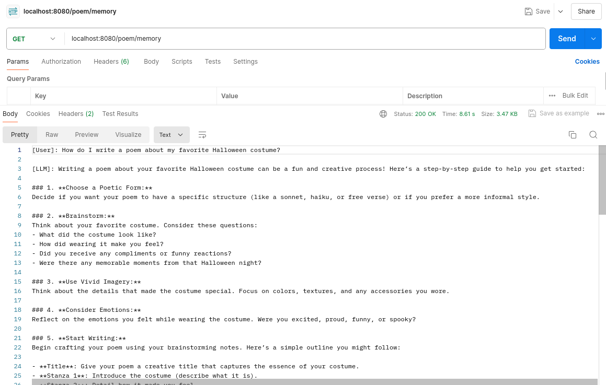
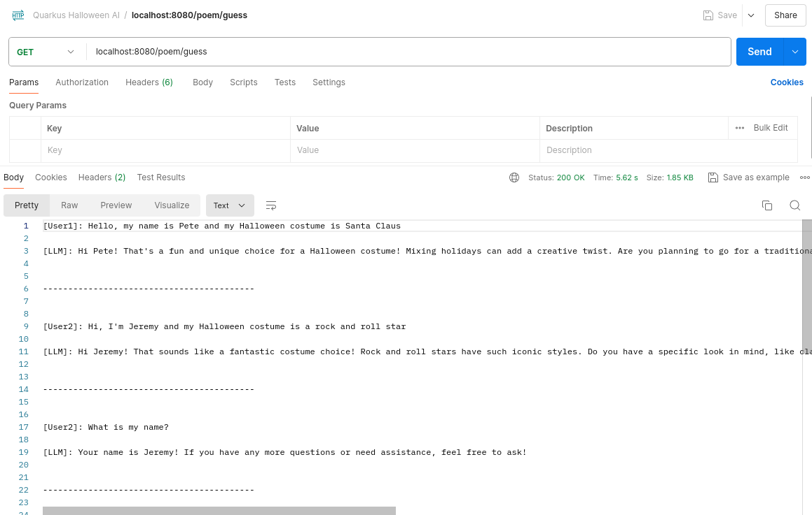

# Working with Memory

In this section, we will build a conversation with the LLM and refer to previous questions and answers and
manage concurrent interactions.

Of course, we will continue to do this with the project we setup in the [Getting Started](01-getting-started.md) section.

## Creating an AI service with memory

Create an interface to the AI service with the memory feature.

````Java
package com.devcorner.developers;

import dev.langchain4j.service.MemoryId;
import dev.langchain4j.service.UserMessage;
import io.quarkiverse.langchain4j.RegisterAiService;

@RegisterAiService()
public interface AssistantWithMemory {

    String chat(@MemoryId Integer memoryId, @UserMessage String message);

}
````

## Create a Resource

Let's create the resource using the proxy to communicate with the API.

Create the DeveloperResource.

````Java
package com.devcorner.developers;

import jakarta.inject.Inject;
import jakarta.ws.rs.GET;
import jakarta.ws.rs.Path;
import jakarta.ws.rs.Produces;
import jakarta.ws.rs.core.MediaType;

@Path("/poem")
public class DeveloperResource {

    @Inject
    private AssistantWithMemory ai;

    @GET
    @Path("/memory")
    @Produces(MediaType.TEXT_PLAIN)
    public String memory() {
        String msg1 = "How do I write a poem about my favorite Halloween costume?";

        String response = "[User]: " + msg1 + "\n\n" +
            "[LLM]: "+ ai.chat(1, msg1) + "\n\n\n" +
            "------------------------------------------\n\n\n";

        String msg2 = "Create a poem about a random costume. " +
                        "Be short, 15 lines of maximum.";

        response += "[User]: " + msg2 + "\n\n"+
            "[LLM]: "+ ai.chat(1, msg2);

        return response;

    }

}
````

Let's invoke the endpoint and see what we get.

We should get something that looks like the following:



## Indexing a conversation

What about indexing a conversation so we can reuse it and keep multiple, parallel conversations separate?

Let's guess.

````Java
    @GET
    @Path("/guess")
    @Produces(MediaType.TEXT_PLAIN)
    public String guess() {
        String msg1FromUser1 = "Hello, my name is Pete and my Halloween costume is Santa Claus";

        String response = "[User1]: " + msg1FromUser1 + "\n\n" +
                "[LLM]: " + ai.chat(1, msg1FromUser1) + "\n\n\n" +
                "------------------------------------------\n\n\n";

        String msg1FromUser2 = "Hi, I'm Jeremy and my Halloween costume is a rock and roll star";

        response += "[User2]: " + msg1FromUser2 + "\n\n" +
                "[LLM]: " + ai.chat(2, msg1FromUser2) + "\n\n\n" +
                "------------------------------------------\n\n\n";

        String msg2FromUser2 = "What is my name?";

        response += "[User2]: " + msg2FromUser2 + "\n\n" +
                "[LLM]: " + ai.chat(2, msg2FromUser2) + "\n\n\n" +
                "------------------------------------------\n\n\n";

        String msg2FromUser1 = "Please write me a 15 line poem about my Halloween costume?";

        response += "[User1]: " + msg2FromUser1 + "\n\n" +
                "[LLM]: " + ai.chat(1, msg2FromUser1) + "\n\n\n" +
                "------------------------------------------\n\n\n";

        return response;
    }
````

After invoking the endpoint, the result should look something like the following:



> [!NOTE]
> Look closely at the IDs and notice we are indeed able to hold 2 different conversations.

