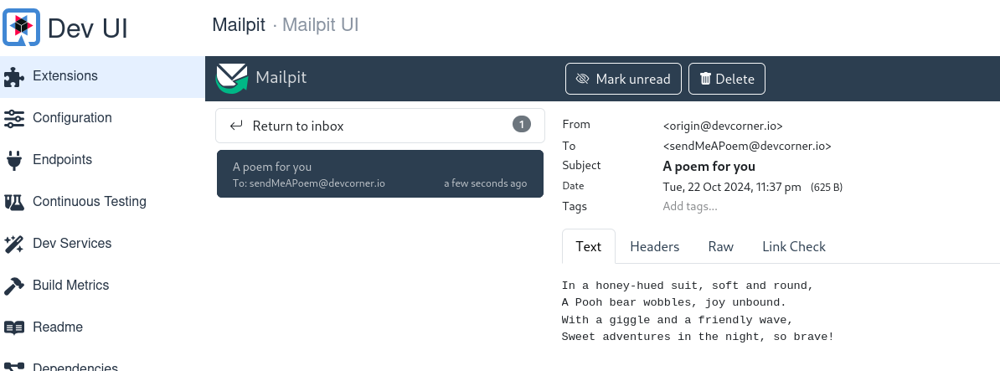

# Working with Agents and Tools

When using an LLM, sometimes we want a decision-maker which will be responsible for determining the subsequent steps.  
The inputs can be:

- Tools: Descriptions of available actions
- User Input: A high-level objective
- Intermediate Steps: Previous (action, tool output) pairs executed in the order to full the user input

The output would then present the next action to take or a final response.

Each action specifies a tool (method name) and its corresponding input parameters.

Tools are methods the agent can invoke.

## Add a Mailer

Let's say that we like our output so much that we want to be emailed our poem or costume selections.

To do so, we can add an extension to the existing project:

````Java
quarkus ext add mailpit mailer
````

## Create the email service

````Java
package com.devcorner.developers;

import jakarta.enterprise.context.ApplicationScoped;
import jakarta.inject.Inject;

import dev.langchain4j.agent.tool.Tool;
import io.quarkus.logging.Log;
import io.quarkus.mailer.Mail;
import io.quarkus.mailer.Mailer;

@ApplicationScoped
public class EmailService {

    @Inject
    Mailer mailer;

    @Tool("send the given content by email")
    public void sendAnEmail(String content) {
        Log.info("Sending an email: " + content);
        mailer.send(Mail
            .withText("sendMeAPoem@devcorner.io", "A poem for you", content)
            .setFrom("origin@devcorner.io"));
    }

}
````

## Creating an AI service with prompt context

Create an interface for the AI service.

We will use a **SystemMessage** and **UserMessage** to give context to the AI model.

In our example, we will tell the Ai to craft a message as if it is written by a professional poet.

The **UserMessage** is the actual instruction/question we're sending to the AI model.

````Java
package com.devcorner.developers;

import dev.langchain4j.service.SystemMessage;
import dev.langchain4j.service.UserMessage;
import io.quarkiverse.langchain4j.RegisterAiService;

@RegisterAiService(tools = EmailService.class)
public interface AssistantWithContext {

    /**
     * Ask the LLM to create a poem about a Halloween costume.
     *
     * @param topic the topic of the poem
     * @param lines the number of line of the poem
     * @return the poem
     */
    @SystemMessage("You are a professional poet")
    @UserMessage("Write a poem about a Halloween costume which is a {costume}. The poem should be {lines} lines long. Then send this poem by email.")
    String writeAPoem(String costume, int lines);

}
````

> [!NOTE]
> The assistant references the email service as a tool.

## Create the email sending resource

Let's create a resource that builds the interaction and calls the service with the required parameters (costume, number of lines).

````Java
package com.devcorner.developers;

import jakarta.ws.rs.GET;
import jakarta.ws.rs.Path;

@Path("/email-me-a-poem")
public class EmailMeAPoemResource {

    private final AssistantWithContext service;

    public EmailMeAPoemResource(AssistantWithContext service) {
        this.service = service;
    }

    @GET
    public String emailMeAPoem() {
        return service.writeAPoem("Winnie the Pooh", 4);
    }

}
````

## Add the email service properties

> [!NOTE]
> We are only using this in dev mode and not configuring a real email service.
> We will be able to test this and see it in the Quarkus Dev UI

````Java
quarkus.langchain4j.openai.log-requests=true
quarkus.langchain4j.openai.log-responses=true
quarkus.langchain4j.openai.timeout=60s

%dev.quarkus.mailer.mock=false
````

If all goes well, we should be running with $ quarkus dev and going to localhost:8080/q/dev-ui see a **mailpit** extension.

Select that and goto the UI and you should see something similar to the following:



