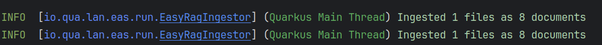
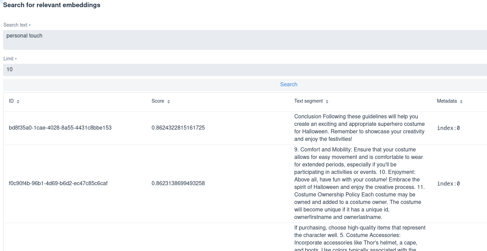

# Working with Retrieval Augmented Generation (RAG)

Sometimes, we will require user-specific data beyond the training set used for the LLM.  These can include documents and data
from various sources.  This is where RAG is typically employed.  

Using RAG, we can combine our own data with the LLM to enrich the possibilities offered by the application.

Following, we're going to embed a document for the LLM, which will use it to determine rules.

## Adding the Websockets and Context Propagation Extensions

For this first pass at RAG, we will take the **easy** way out and employ LangChain4j Easy RAG.

````Bash
quarkus ext add websockets-next langchain4j-easy-rag
````

## Add properties to our configuration

````Java

quarkus.langchain4j.openai.chat-model.temperature=0.0
quarkus.langchain4j.easy-rag.path=src/main/resources/catalog

costume.minpersonsage=12
costume.maxpersonage=20
costume.type=superhero
costume.name=Thor
costume.ownerfirstname=Eric
costume.ownerlastname=Deandrea
costume.id=123-456

quarkus.langchain4j.openai.chat-model.model-name=gpt-4o
````

1. The "temperature" parameter in an AI language models controls the randomness of text generation.  Lower values result in 
    more predictable outputs, while higher values encourage creativity and diversity in responses.
2. Path is literally the path to where documents are stored for the Reetrieval Augmentation Generation (ie. the documents the Ai model will use to build local knowledge.)
3. Sample costume data
4. The specific model to use. **IMPORTANT:** gpt3.5-turbo is much cheaper but results will be slower and less reliable

## Embedding the document

Copy and paste the following into a document under **src/main/resources/catalog** with the name halloween-superhero-costume.txt.

````Text
Rules for Creating a Halloween SuperHero Costume
This document outlines the guidelines for creating a Halloween costume inspired by a superhero, for individuals aged 12 to 20. Whether you're aiming for authenticity or a creative twist, these rules will help you craft the perfect look.
Costume Guidelines
1. Character Authenticity:
Your costume should reflect the traditional appearance of the superhero as depicted in comic books and movies. This includes elements such as their armor, cape, color and props.
2. Age-Appropriate Design:
Ensure that your costume is suitable for your age group. It should be fun and creative without being overly revealing or inappropriate.
3. Safety Considerations:
When creating your costume, prioritize safety. Avoid materials that could cause injury, such as sharp edges or heavy items. If using props like Mjolnir, ensure they are lightweight and won’t pose a danger to yourself or others.
4. DIY vs. Store-Bought:
You can either create your costume from scratch (DIY) or purchase pieces from stores. If purchasing, choose high-quality items that represent the character well.
5. Costume Accessories:
Incorporate accessories like Thor's helmet, a cape, and boots. Use colors typically associated with the superhero.  In example, the superhero Thor is associated with: red, silver, blue, and black.
6. Personal Touch:
Feel free to add your own flair to the costume. This could include custom designs, unique materials, or additional superhero elements.
7. Group Costumes:
If you're dressing up with friends, consider coordinating your costumes to represent a group of superheroes from the Marvel or DC universe.
8. Respectful Representation:
Be mindful of cultural and personal sensitivities when representing the superhero, especially considering the characters background, setting and the character's origins.
9. Comfort and Mobility:
Ensure that your costume allows for easy movement and is comfortable to wear for extended periods, especially if you'll be participating in activities or events.
10. Enjoyment:
Above all, have fun with your costume! Embrace the spirit of Halloween and enjoy the creative process.
11. Costume Ownership Policy
Each costume may be owned and added to a costume owner.  The costume will become unique if it has a unique id, ownerfirstname and ownerlastname.
12. Costume Removal Policy
A costume can only be removed from the list if the costume id, ownerfirstname and ownerlastname are provided.
13. Costume Details Policy
A costume details may be returned if the costume id, ownerfirstname and ownerlastname are provide.
Conclusion
Following these guidelines will help you create an exciting and appropriate superhero costume for Halloween. Remember to showcase your creativity and enjoy the festivities!
````

## Let's Create the Costume Character Structure

Create a Owner record.

````Java
package com.devcorner.developers;

public record Owner(String firstName, String lastName) {
}

````

Create the Costume record.

````Java
package com.devcorner.developers;

public record Costume(String id,
                      String costumeName,
                      String costumeType,
                      Long minAge,
                      Long maxAge,
                      Owner owner) {
}
````

## Create a Costume Service

Create a simplified Costume service for the LLM to call.

````Java
package com.devcorner.developers;

import java.util.Map;

import org.eclipse.microprofile.config.inject.ConfigProperty;

import jakarta.enterprise.context.ApplicationScoped;
import jakarta.inject.Inject;

@ApplicationScoped
public class CostumeService {

    @Inject
    @ConfigProperty(name = "costume")
    Map<String, String> costumes;

    public Costume getCostumeDetails(String id, String ownerFirstName, String ownerLastName) {
        ensureExists(id, ownerFirstName, ownerLastName);
        String costumeName = costumes.get("costumename");
        String costumeType = costumes.get("costumetype");
        Long minAge = Long.parseLong(costumes.get("minage"));
        Long maxAge = Long.parseLong(costumes.get("maxage"));

        // Retrieval from DB mocking
        Owner owner = new Owner(ownerFirstName, ownerLastName);
        return new Costume(id, costumeName, costumeType, minAge, maxAge, owner);
    }

    public void removeCostume(String id, String ownerFirstName, String ownerLastName) {
        ensureExists(id, ownerFirstName, ownerLastName);

        // TODO add logic to double check costume in case the LLM got it
        // wrong.
        // throw new BookingCannotBeCancelledException(bookingNumber);
    }

    private void ensureExists(String id, String ownerFirstName, String ownerLastName) {
        // Check mocking
        if (!(id.equals(costumes.get("id"))
                && ownerFirstName.toLowerCase().equals(costumes.get("ownerfirstname"))
                && ownerLastName.toLowerCase().equals(costumes.get("ownerlastname")))) {
            throw new CostumeNotFoundException(id);
        }
    }
}

class CostumeNotFoundException extends RuntimeException {

    public CostumeNotFoundException(String id) {
        super("Costume " + id + " not found");
    }
}

class CostumeCannotBeRemovedException extends RuntimeException {

    public CostumeCannotBeRemovedException(String id) {
        super("Costume " + id + " cannot be removed");
    }
}

````

## Define a CostumeTools singleton

This will serve the AI with the proper tools.

````Java
package com.devcorner.developers;

import jakarta.inject.Singleton;

import dev.langchain4j.agent.tool.Tool;

@Singleton
public class CostumeTools {

    private final CostumeService costumeService;

    public CostumeTools(CostumeService costumeService) {
        this.costumeService = costumeService;
    }

    @Tool
    public Costume getCostumeDetails(String id, String ownerFirstName, String ownerLastName) {
        return costumeService.getCostumeDetails(id, ownerFirstName, ownerLastName);
    }

    @Tool
    public void removeCostume(String id, String ownerFirstName, String ownerLastName) {
        costumeService.removeCostume(id, ownerFirstName, ownerLastName);
    }
}
````

## Create the costume support service

Now we can create a structure for our AI based costume service.

````Java
package com.devcorner.developers;

import dev.langchain4j.service.SystemMessage;
import dev.langchain4j.service.UserMessage;
import io.quarkiverse.langchain4j.RegisterAiService;
import jakarta.enterprise.context.SessionScoped;

@RegisterAiService(tools = CostumeTools.class)
@SessionScoped
public interface AssistantForCostumeSupport {

    @SystemMessage({
            "You are a costume support agent for generating Halloween costumes.",
            "Before providing information about current costumes or removing a costume, you MUST always check:",
            "costume id, owner first name and owner last name as provided in the Costume Removal Policy",
            "Before removing a costume, confirm with the user that they want to proceed",
            "Do NOT remove the costume if the costume information is not compliant with the Costume Removal policy in the Rules for Creating a Halloween SuperHero Costume"
    })
    String chat(@UserMessage String userMessage);
}
````

## Create a ChatSocket for the chat interface

````Java
package com.devcorner.developers;

import io.quarkus.websockets.next.OnOpen;
import io.quarkus.websockets.next.OnTextMessage;
import io.quarkus.websockets.next.WebSocket;

@WebSocket(path = "/chat")
public class ChatSocket {

    private final AssistantForCostumeSupport assistant;

    public ChatSocket(AssistantForCostumeSupport assistant) {
        this.assistant = assistant;
    }

    @OnOpen
    public String onOpen() {
        return "Hello from your Halloween Costume Creator, how can we help you?";
    }

    @OnTextMessage
    public String onMessage(String userMessage) {
        return assistant.chat(userMessage);
    }
}
````

## Create a simple chat frontend 

Create a chat assistant in **src/main/resources/META-INF/resources** called **chat-assistant.html**.

````HTML
<!DOCTYPE html>
<html>

<head>
    <meta charset="UTF-8">
    <title>Quarkus Langchain4j Chat!</title>
    <link rel="stylesheet" type="text/css" href="https://cdnjs.cloudflare.com/ajax/libs/patternfly/3.24.0/css/patternfly.min.css">
    <link rel="stylesheet" type="text/css" href="https://cdnjs.cloudflare.com/ajax/libs/patternfly/3.24.0/css/patternfly-additions.min.css">

    <style>
        #chat {
          resize: none;
          overflow: hidden;
          min-height: 300px;
          max-height: 300px;
      }
    </style>
</head>

<body>
        <nav class="navbar navbar-default navbar-pf" role="navigation">
                <div class="navbar-header">
                  <a class="navbar-brand" href="/">
                   <p><strong>>> Halloween AI Chat!</strong></p>
                  </a>
                </div>
        </nav>
    <div class="container">
      <br/>
      <div class="row">
          <textarea data-testid="chatwin" class="col-md-8" id="chat"></textarea>
      </div>
      <div class="row">
          <input class="col-md-6" id="msg" type="text" placeholder="enter your message">
          <button class="col-md-1 btn btn-primary" id="send" type="button" disabled>send</button>
      </div>

      </div>

    <script src="https://cdnjs.cloudflare.com/ajax/libs/jquery/3.2.1/jquery.min.js"></script>
    <script src="https://cdnjs.cloudflare.com/ajax/libs/twitter-bootstrap/3.3.7/js/bootstrap.min.js"></script>
    <script src="https://cdnjs.cloudflare.com/ajax/libs/patternfly/3.24.0/js/patternfly.min.js"></script>

    <script type="text/javascript">
      var connected = false;
      var socket;

      $( document ).ready(function() {
          connect();
          $("#send").click(sendMessage);

          $("#name").keypress(function(event){
              if(event.keyCode == 13 || event.which == 13) {
                  connect();
              }
          });

          $("#msg").keypress(function(event) {
              if(event.keyCode == 13 || event.which == 13) {
                  sendMessage();
              }
          });

        $("#chat").change(function() {
            scrollToBottom();
          });

          $("#name").focus();
      });

      var connect = function() {
          if (! connected) {
              socket = new WebSocket("ws://" + location.host + "/chat");
              socket.onopen = function(m) {
                  connected = true;
                  console.log("Connected to the web socket");
                  $("#send").attr("disabled", false);
                  $("#connect").attr("disabled", true);
                  $("#name").attr("disabled", true);
                  $("#msg").focus();
              };
              socket.onmessage =function(m) {
                  console.log("Got message: " + m.data);
                  $("#chat").append("[Assistant] " + m.data + "\n");
                  scrollToBottom();
              };
          }
      };

      var sendMessage = function() {
          if (connected) {
              var value = $("#msg").val();
              console.log("Sending " + value);
              $("#chat").append("[You] " + value + "\n")
              socket.send(value);
              $("#msg").val("");
          }
      };

      var scrollToBottom = function () {
        $('#chat').scrollTop($('#chat')[0].scrollHeight);
      };

    </script>
</body>

</html>
````

## Run the endpoint

We can invoke the endpoint by navigating in our browser to **http://localhost:8080/chat-assistant.html**.


## Configuring Easy RAG

Although we have already given a property for RAG to find out documents, _quarkus.langchain4j.easy-rag.path=src/main/resources/catalog_, 
we can add several additional properties to the configuration.

````Java
quarkus.langchain4j.easy-rag.max-segment-size=100
quarkus.langchain4j.easy-rag.max-overlap-size=25
quarkus.langchain4j.easy-rag.max-results=3
````

What did this configuration do exactly?

- _quarkus.langchain4j.easy-rag.max-segment-size_: The maximum number of tokens in a segment.  Each document is split into
segments (chunks) which can be ingested by the LLM.  This parameter defines the maximum number of tokens in a segment.
- _quarkus.langchain4j.easy-rag.max-overlap-size_: The maximum number of tokens to overlap between two segments.  Each segment overlaps
with the previous one by this number of tokens.  This allows the LLM to have a context between two segments.
- _quarkus.langchain4j.easy-rag.max-results_: The maximum number of results to return when querying the knowledge base.

## Testing the RAG pattern

Run the application in Dev mode and open the browser to localhost:8080.

### Ingestion and Embedding

When we start the application, we should see something like the following in the log:



That data from the catalog directory is being ingested. The files are read from the configured directory, split into segments, 
and stored in the knowledge base. In our case, the knowledge base is in memory. We will see in the next steps how to use 
a persistent knowledge base.

The segments are not stored as-is in the knowledge base. They are transformed into vectors, also called embeddings. This 
is a way to represent the text in a numerical form. So, in the knowledge base, we have the text and the corresponding 
embeddings. These embeddings are computed using embedding models. Right now, we use the default embedding model provided 
by OpenAI. We will see in the next steps how to use your own embedding model.

### Reviewing this with the Quarkus Dev UI.

Open the Quarkus DEV UI at localhost:8080/q/dev-ui and locate the LangChain4j tile.  Then click on the _Embedding Store_ link:


Then look for the **Search for relevant embeddings** section.  Enter a query in the **Search text** field, for example, 
**personal touch**, and then click on the **Search** button.



You should see the segments _close_ to the searched text.  We can visualize the segments, but also their score, i.e., how 
close they are to the searched text.

To find relevant segments, it computes the embeddings of the searched text and then compares them to the embeddings of the
segments.  It applies a similarity search using a distance computation (like the cosine similarity).  The closer the embeddings,
the higher the score.

Using the RAG pattern, the LLM can receive an extended prompt and can provide more accurate response information.