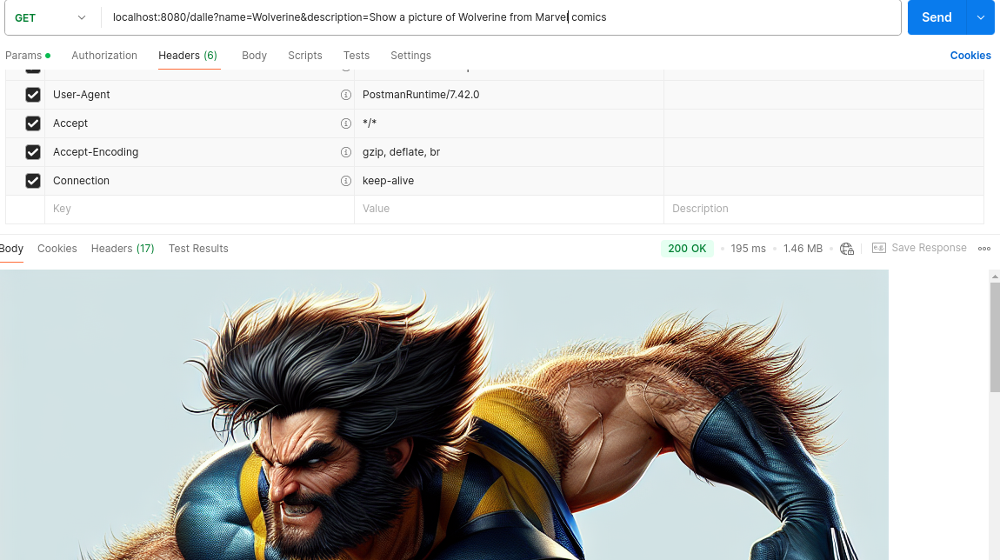
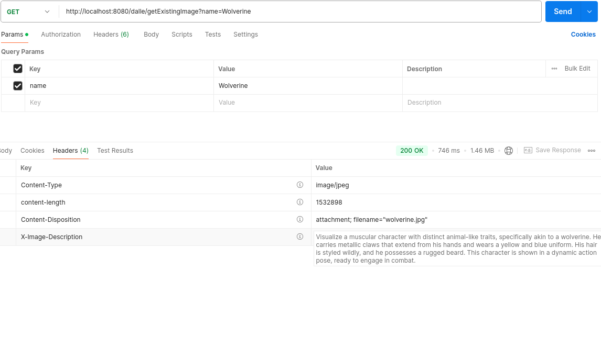

# Working with Images

In order to generate images, we will continue to use LangChain4j the Quarkus way.  That is, the easy way.

## Adding properties

Let's continue to use OpenAI API and add the properties for defaulting the image generated.

````Java
quarkus.langchain4j.openai.image-model.enabled=true
quarkus.langchain4j.openai.image-model.model-name=dall-e-3
quarkus.langchain4j.openai.timeout=1m
quarkus.langchain4j.openai.image-model.size=1024x1024
quarkus.langchain4j.openai.image-model.quality=standard
quarkus.langchain4j.openai.image-model.style=vivid
````

Several of these are already defaults.  But, we will need to know: 

- The model name.  In this case dall-e-3 as the default is dalle-2 and the images aren't so fantastic looking.
- The size, which is already defaulted to 1024x1024, but which we will write out here just to be pedantic.
- The timeout.  This is required as the time it takes to generate the images will vary.
- The quality and styles are defaults.  But, you can change them based on the documentation.

## Create the simple service

There are really only three lines in the following code which do all the work.

````Java
    @GET
    @Produces(MediaType.APPLICATION_JSON)
    public Response generateImage(@QueryParam("name") String name,
                                  @QueryParam("description") String description) throws IOException {

        var image = imageModel.generate(description);
        var uri = image.content().url();
        var desc = image.content().revisedPrompt();
````

Although the model is used to generate the image, it really does a lot.  You can change the default size, type, etc... which 
were all previously set in the properties file.

> [!NOTE]
> We are using a **var** here as it will return a **response** object which is overloaded in our service with the jakarta namespace.
> So, rather than deal with spelling the entire namespace+class out, we will simply use var

> [!NOTE]
> The model response returns a url, or set of urls if using the v2 model.
> This information also comes with a **revised** prompt.  This is important, because the image actually generated was derived
> from the revised prompt.  In out case, we are using query's for copyrighted information and the revised prompt is describing
> the thing we wanted in terms which will not break the copyright.


````Java
package com.devcorner.developers;

import dev.langchain4j.model.image.ImageModel;
import jakarta.enterprise.context.ApplicationScoped;
import jakarta.inject.Inject;
import jakarta.ws.rs.*;
import jakarta.ws.rs.core.MediaType;
import jakarta.ws.rs.core.Response;

import java.io.BufferedReader;
import java.io.File;
import java.io.FileReader;
import java.io.IOException;
import java.nio.file.Files;
import java.nio.file.StandardCopyOption;
import java.util.logging.Logger;

@ApplicationScoped
@Path( "/dalle")
public class DalleService {

    private static final Logger LOG = Logger.getLogger(DalleService.class.getName());

    @Inject
    ImageModel imageModel;

    @GET
    @Produces(MediaType.APPLICATION_JSON)
    public Response generateImage(@QueryParam("name") String name,
                                  @QueryParam("description") String description) throws IOException {

        var image = imageModel.generate(description);
        var uri = image.content().url();
        var desc = image.content().revisedPrompt();

        String fname = name.replaceAll("\\s", "");
        fname = fname.toLowerCase();
        var file = new File(fname + ".jpg");
        Files.copy(uri.toURL().openStream(), file.toPath(), StandardCopyOption.REPLACE_EXISTING);
        LOG.info("file://" + file.getAbsolutePath());

        var descFile = new File(fname + ".txt");
        Files.writeString(descFile.toPath(), desc);
        LOG.info(desc);

        return Response
                .seeOther(uri)
                .build();
    }

    @GET
    @Path("/getPreviouslyGeneratedImage")
    @Produces("image/jpeg")
    public Response getExistingImage(@QueryParam("name") String name) throws IOException {

        LOG.info("getPreviouslyGeneratedImage");

        String fname = name.replaceAll("\\s", "");
        fname = fname.toLowerCase();
        LOG.info("file://" + fname + ".jpg");
        File imageFile = new File("./" + fname + ".jpg");

        if (!imageFile.exists()) {
            return Response.status(Response.Status.NOT_FOUND).build();
        }

        StringBuffer sb = new StringBuffer();
        try {
            BufferedReader descFile = new BufferedReader(new FileReader("./" + fname + ".txt"));

            String line;
            while ((line = descFile.readLine()) != null) {
                sb.append(line);
            }
        } catch (IOException ex) {
            return Response.status(Response.Status.NOT_FOUND).build();
        }

        return Response.ok(imageFile)
                .header("Content-Disposition", "attachment; filename=\"" + imageFile.getName() + "\"")
                .header("X-Image-Description", sb.toString())
                .build();
    }

}
````

> [!NOTE]
> Excuse the poor code quality as this is simply an example.

## Running the code

Running the code in dev mode will produce the following when tested in Postman



### Reviewing the saved image

We saved off the image and the resulting **revised** prompt from the generation and can retrieve it from the filesystem
using the **getExistingImage** query.  We stored the revised prompt so you could inspect it later.



That's all there was to it using Quarkus with LangChain4j.  Of course, you can play around more with all the properties and 
settings.


